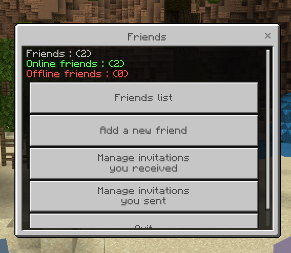

## Friends system

This plugin enables players to manage their friends directly within the game environment. Uusers can send friend requests, accept or reject invitations, teleport to friends, and more.

### Commands

| Command                        | Description                            |
|--------------------------------|----------------------------------------|
| `/friend help`                 | Display this help message.             |
| `/friend invite/add (player)`  | Send a friend request to a player.     |
| `/friend cancel (player)`      | Cancel a friend invitation you sent.   |
| `/friend accept (player)`      | Accept a friend request from a player. |
| `/friend deny/reject (player)` | Deny a friend request from a player.   |
| `/friend remove (player)`      | Remove a friend from your list.        |
| `/friend tp/join (player)`     | Teleport to your friend.               |
| `/friend list`                 | Show your friend list.                 |
| `/friend info`                 | Open the default menu.                 |

### Default Menu



**When you don't specify a sub-command, the plugin displays a default menu** where you can navigate and perform available actions by clicking on buttons. **You can perform all available actions with commands by simply navigating through this menu.**


### Features

- SQLite provider ❌
- JSON provider ❌
- MySQL provider ✅ (Please configure MySQL connection)


### Installation
#### Dependencies

This plugin relies on the following libraries:
- [libasynql](https://github.com/poggit/libasynql)
- [await-generator](https://github.com/SOF3/await-generator)
- [pmforms](https://github.com/dktapps-pm-pl/pmforms)

1. Download the plugin and place it in the `plugins` folder of your PMMP server.
2. Configure the MySQL connection details in the `config.yml` file.
3. Restart your server to load the plugin.

### Configuration

In the `config.yml` file, update the MySQL connection details as follows:

```yaml
host: "REPLACE_WITH_MYSQL_HOST"
username: "REPLACE_WITH_MYSQL_USERNAME"
password: "REPLACE_WITH_MYSQL_PASSWORD"
schema: "REPLACE_WITH_MYSQL_SCHEMA_NAME"
```
⚠️ Replace `REPLACE_WITH_MYSQL_HOST`, `REPLACE_WITH_MYSQL_USERNAME`, `REPLACE_WITH_MYSQL_PASSWORD`, and `REPLACE_WITH_MYSQL_SCHEMA_NAME` with your MySQL server details.

### Issues and Feedback

If you encounter any issues or have suggestions for improvements, please submit them to the [GitHub repository's issue section](https://github.com/Pocketmobs/PokeFriends/issues).

Discord : **fenomeno__**